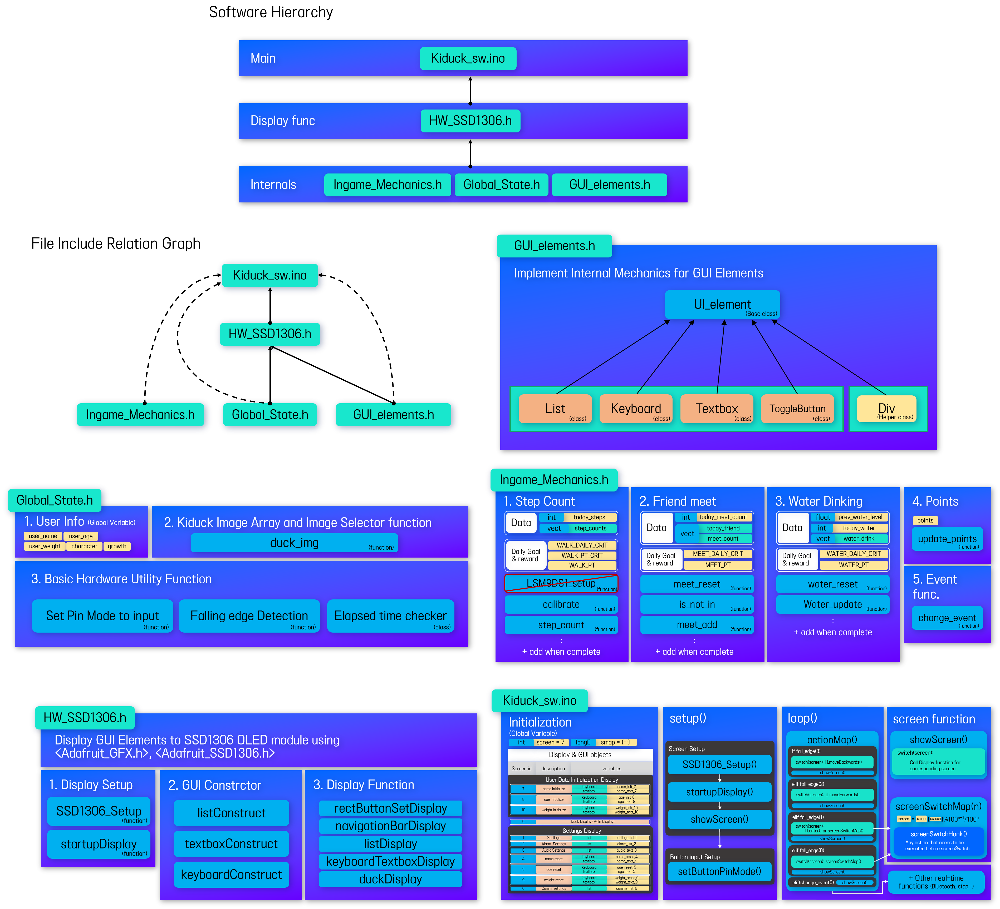

# KiDuck Software

Software for KiDuck, a handheld device for aiding swift recovery of hospitalized children.

# Demonstration

# Developement Progress
### Integrate other codes
- [x] Sync with Application via bluetooth
- [ ] Step Count
- [ ] Sync with Water Bottle
- [ ] Infrared Communication for Friend Meeting

# Software Structure Overview
(Outdated->Need Update)

